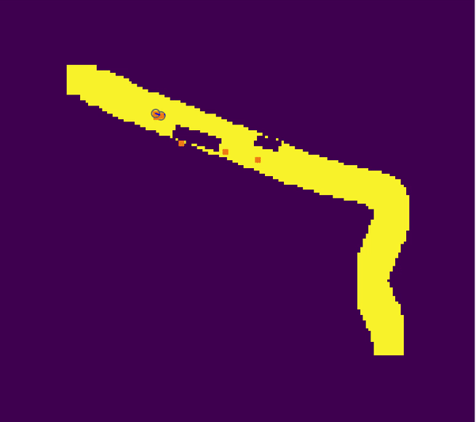
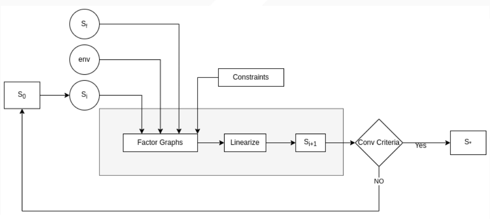
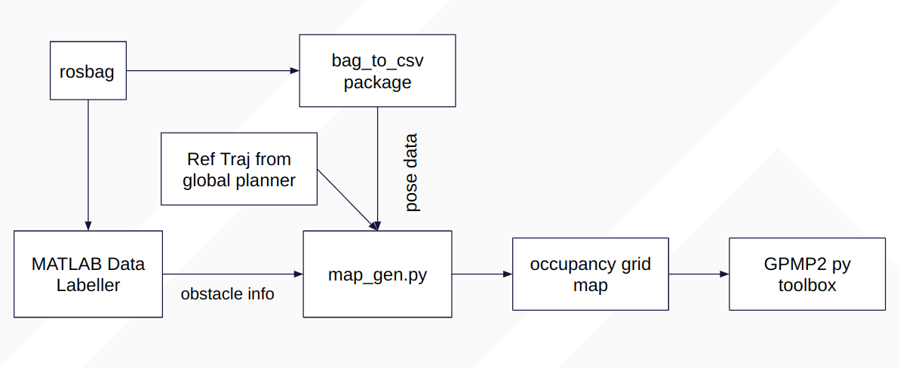
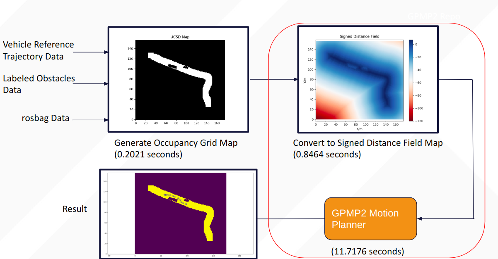

# <ins>Obstacle Avoidance and Overtaking - Documentation

Introduction
  ------
  In this project, we are implementing the Gaussian Process Motion Planner 2 for obstacle avoidance and overtaking. Essentially, we are trying to solve a trajectory optimization problem given an objective function that encodes an obstacle-free path given path-bound and motion constraints. In order to decrease the complexity of the optimization problem, the constraints are modeled using factor graphs. The initial simulation was done on datasets from the summer of 2019 which mimic the static obstacle avoidance scenarios.
  
  </a>

Relevant Links:
[Literature](https://faculty.cc.gatech.edu/~bboots3/files/GPMP2.pdf) | [GPMP2 Github](https://faculty.cc.gatech.edu/~bboots3/files/GPMP2.pdf) | [Simulation](https://github.com/AutonomousVehicleLaboratory/UCSD_AVL_GPMP2)  
  
Installation
  ------
### Prerequisites

- CMake >= 3.0 (Ubuntu: `sudo apt-get install cmake`), compilation configuration tool.
- [Boost](http://www.boost.org/) >= 1.50 (Ubuntu: `sudo apt-get install libboost-all-dev`), portable C++ source libraries.
- [Anaconda2](https://docs.anaconda.com/anaconda/install/linux/), virtual environment needed if installing python toolbox.
- [GTSAM](https://github.com/borglab/gtsam/tree/wrap-export) == `wrap_export`, a C++ library that implements smoothing and mapping (SAM) framework in robotics and vision. Here we use the factor graph implementations and inference/optimization tools provided by GTSAM.
  
  
### Installation (C++ with Python toolbox)

- Setup virtual environment.
  ```bash
  conda create -n gpmp2 pip python=2.7
  conda activate gpmp2
  pip install cython numpy scipy matplotlib
  conda deactivate
  ```
- Install GTSAM.
  ```bash
  conda activate gpmp2
  git clone https://github.com/borglab/gtsam.git
  cd gtsam
  git checkout wrap-export
  mkdir build && cd build
  cmake -DGTSAM_INSTALL_CYTHON_TOOLBOX:=ON ..
  make check  # optional, run unit tests
  sudo make install
  conda deactivate
  ```
- Setup paths.
  ```bash
  echo 'export LD_LIBRARY_PATH=/usr/local/lib:${LD_LIBRARY_PATH}' >> ~/.bashrc
  echo 'export LD_LIBRARY_PATH=/usr/local/share:${LD_LIBRARY_PATH}' >> ~/.bashrc
  echo 'export PYTHONPATH=/usr/local/cython:${PYTHONPATH}' >> ~/.bashrc
  source ~/.bashrc
  ```
- Install gpmp2.
  ```bash
  conda activate gpmp2
  git clone https://github.com/gtrll/gpmp2.git
  cd gpmp2 && mkdir build && cd build
  cmake -DGPMP2_BUILD_PYTHON_TOOLBOX:=ON ..
  make check  # optional, run unit tests
  sudo make install
  cd ../gpmp2_python && pip install -e .
  conda deactivate
  
For more detailed instructions on installation, refer to these sites: [gtrll-gpmp2](https://github.com/gtrll/gpmp2) and [borglab-gpmp2](https://github.com/borglab/gpmp2)
The above installation instructions is according to the repo maintained by gtrll. Please note that the latest repo is maintained by Borg Lab. We faced multiple issues with installation of the borg lab repo. Refer to this [issue](https://github.com/borglab/gpmp2/issues/12) for more details.
  
Simulations
------
  
    
  
 In this section, we explain the details regarding different simulations performed using the data collected by our golf cart. The above figure briefly summarises the trajectory optimization algorithm of GPMP2. These simulations were performed for static obstacles only using the rosbag file. Different constraints on the objective function are: obstacles, velocity and kinematic model. 
  
  

  
  - rosbag: bags are primary mechanism in ROS for data logging. They are used to record campus golf cart data and used in this project for multiple uses.
  - bag to csv package: this ros package is used to convert different topics from ros bag into csv files to be used for post processing.
  - MATLAB data labeller: [Label](https://www.mathworks.com/help/driving/ref/groundtruthlabeler-app.html) ground truth data for automated driving applications.
  - ref traj: this reference trajectory is generated from stack 1.0 to identify lane widths and pavements.
  - map gen: this python scripts is used to generate static binary occupancy grid map involving the ego car and obstacles.
  - gpmp2 py: this python script optimizes the trajectory using GTSAM and GPMP2 framework
  
 

  
  We performed simulations by including multiple obstacles and changing different parameters which are explained below. The result images can be found in the sim_results folder.
  
  ### Parameters
  
  - Input: start pose, end pose, velocity
  - Factor Graph: prior factor, vehicle dyanamics factor and obstacle factor
  - Optimizer: DogLeg or GN optimizer
  - Time settings: total steps, step size, interpolation
  - SDF: 2D signed distance field, cost_sigma, epsilon distance
  - Threshold: goal_reg and error threshold
  

  
  
